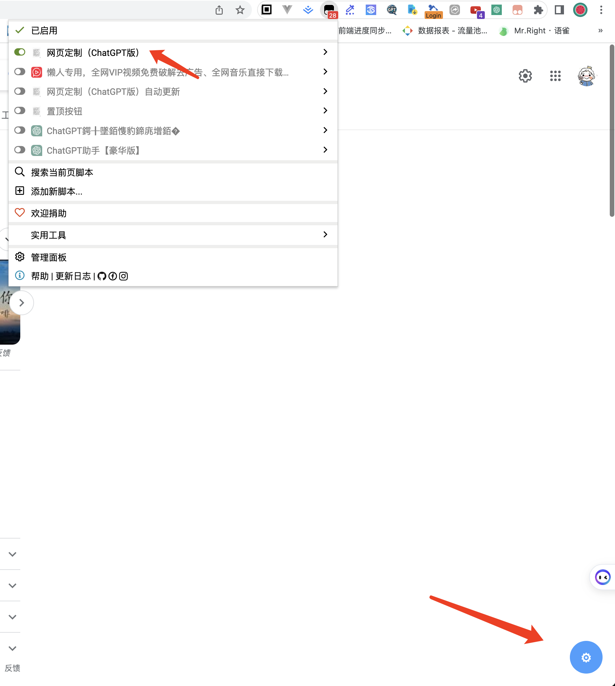
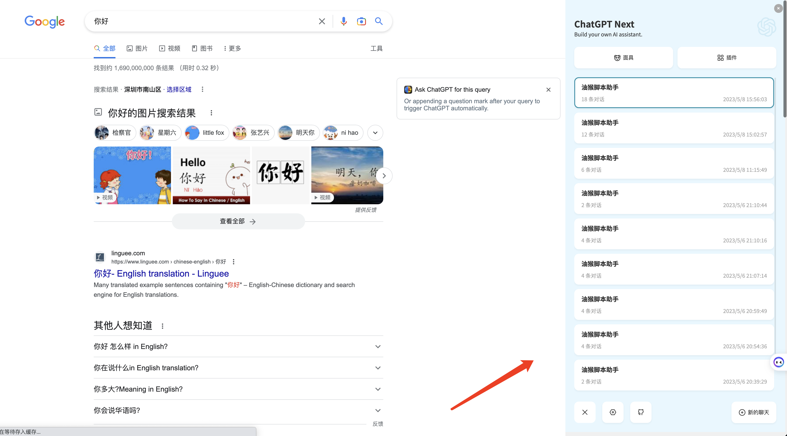
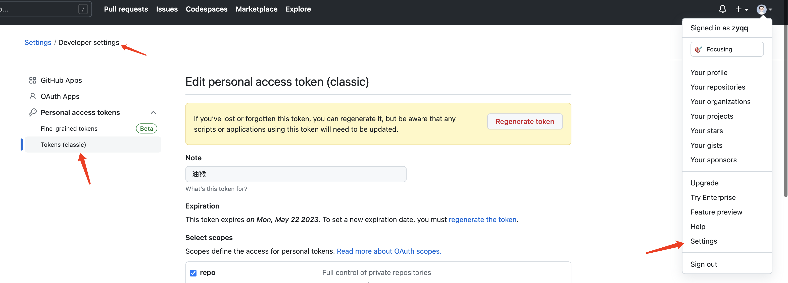
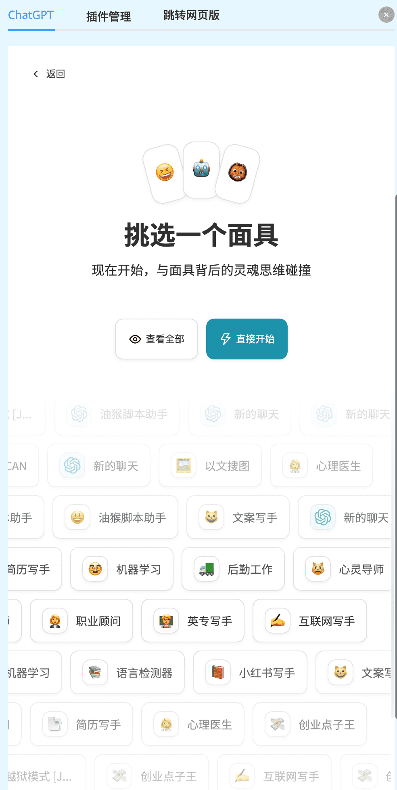
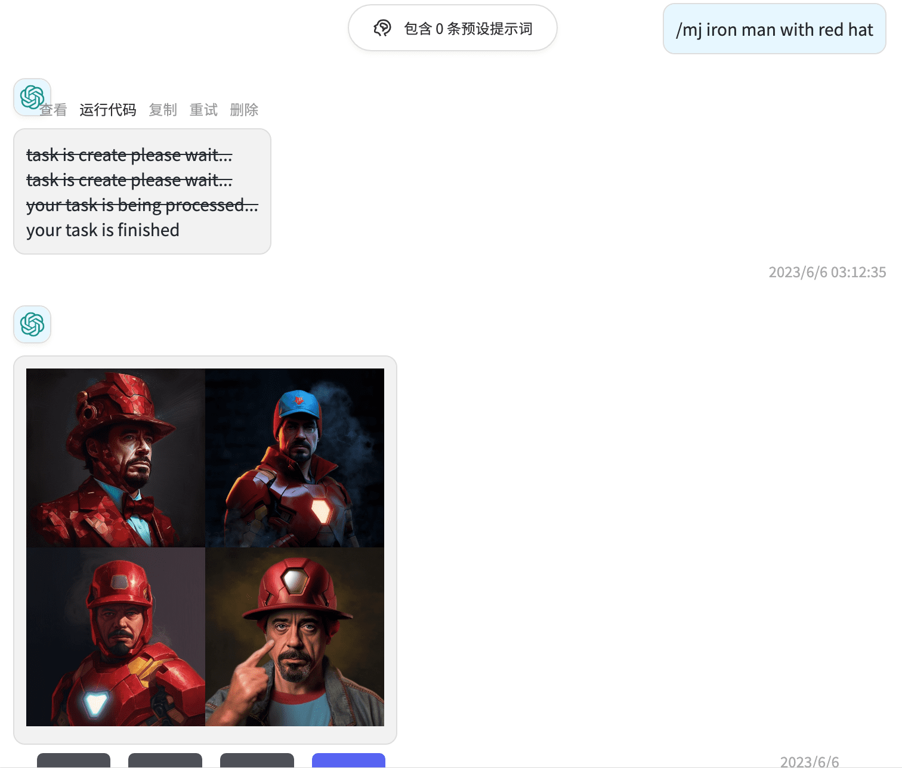
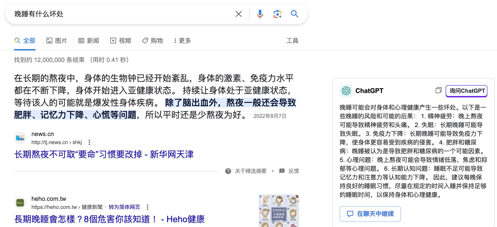
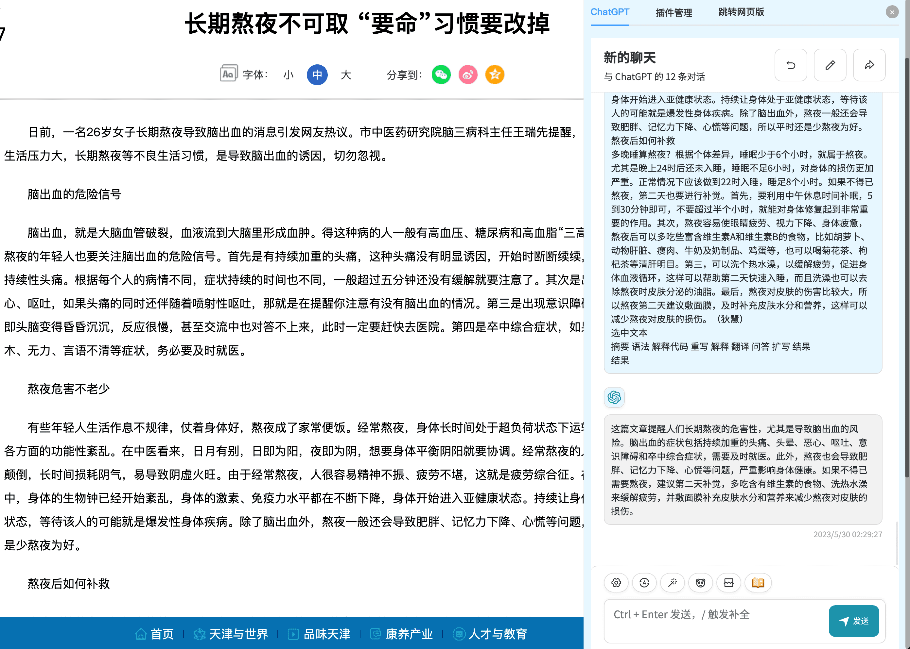
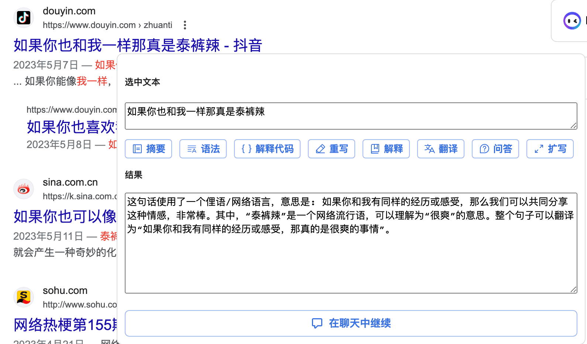
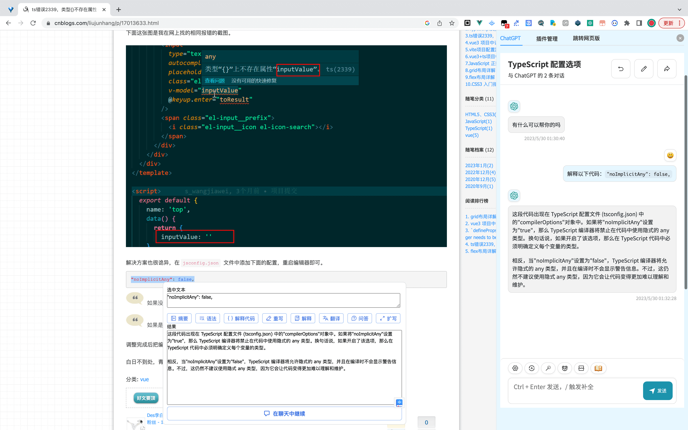
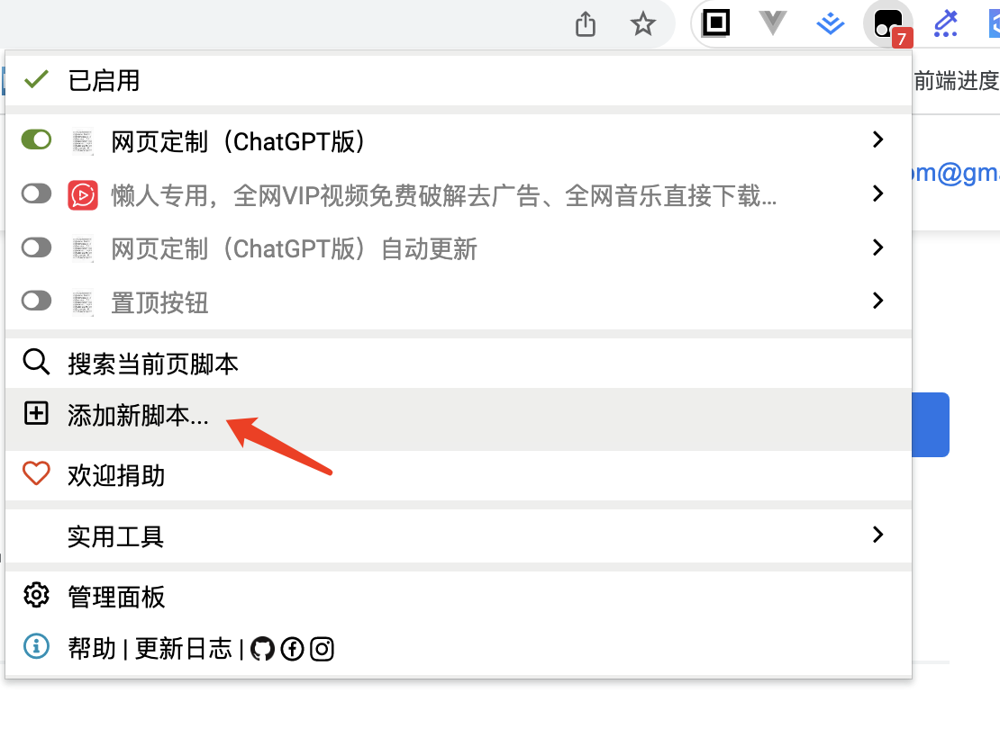

# 网页定制油猴插件

## 一、简介

这是一个定制网页的油猴脚本插件相关代码，展示如下：

## 二、目录结构

### 1、drawIframe.js

编写了插件的交互逻辑及样式：网页右下角的按钮，点击可以弹出内嵌的ChatGPT网站iframe，内嵌的iframe项目地址为：<https://github.com/zyqq/ChatGPT-Next-Web>

### 2、autoUpdate.js

放在油猴插件中的代码，会自动更新drawIframe.js中的代码。用于公共仓库。

### 2、autoUpdatePrivate.js

放在油猴插件中的代码，会自动更新drawIframe.js中的代码，用于私有仓库，去仓库中生成accessToken，更新到代码中。

最后将其复制到油猴插件中即可。

## 三、计划内容

- ✅ ChatGPT交互
  - 自定义prompt与角色

  

  - 支持Midjourney出图

  

- ✅  支持搜索同时也询问ChatGPT

  
- ✅ 网页内容阅读总结

  
- ✅ 选中文本

  

  - 摘要
  - 语法
  - 解释
  - 解释代码
  
  

  - 重写
  - 翻译
- ✅ 油猴脚本助手（已生成prompt模板，待完善30%）
  - 案例
  - 用户需求精确引导
  
  

- ✅ 兼容
  - 禁止iframe的网站兼容处理
  - 提供直接跳转网页按钮
- ✅ 插件市场
  - 用户生成的油猴脚本，点击运行后自动保存插件配置，自动打开
  - 推荐其他插件

## 四、如何使用

安装[油猴插件](https://chrome.google.com/webstore/detail/tampermonkey/dhdgffkkebhmkfjojejmpbldmpobfkfo)，将autoUpdatePrivate.js的代码复制到油猴插件中即可。

## 五、本地测试

- 1、本地启动：ChatGPT-Tampermonkey

- 2、新增 drawIframe.js 油猴脚本，将domain改为：<http://localhost:3000/#/>

- 3、修改 drawIframe.js 则编辑油猴脚本，手动复制粘贴；修改ChatGPT聊天室则会自动更新

## 六、开发协作

- 从 main 新建分支，命名规范为：[name]/[feature|fix]/[修改点]
- 提 mr 到 main

油猴脚本代码会自动更新拉取 drawIframe.js 代码

## 七、联系方式

微信公众号关注：秋博士，可获取访问密码

