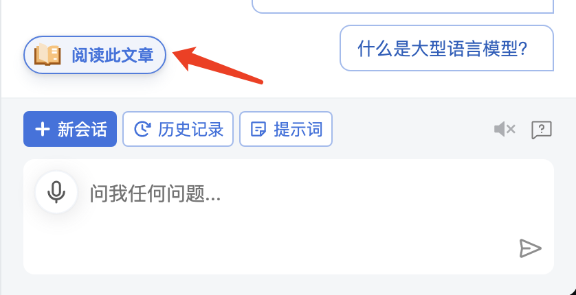

# 网页定制油猴插件

## 一、简介

> 油猴插件下载地址：<https://chrome.google.com/webstore/detail/tampermonkey/dhdgffkkebhmkfjojejmpbldmpobfkfo>

这是一个定制网页的油猴脚本插件相关代码，展示如下：

## 二、目录结构

### 1、drawIframe.js

编写了插件的交互逻辑及样式：网页右下角的按钮，点击可以弹出内嵌的ChatGPT网站iframe，内嵌的iframe项目地址为：<https://github.com/zyqq/ChatGPT-Next-Web>

### 2、autoUpdate.js

放在油猴插件中的代码，会自动更新drawIframe.js中的代码。将其复制到油猴插件中即可。

## 三、计划内容

- ✅ ChatGPT交互
- [] 油猴脚本助手（已生成prompt模板，待完善30%）
  - 案例
  - 用户需求精确引导
- [] 选中文本
  
  - 摘要
  - 语法
  - 解释
  - 解释代码
  
  - 重写
  - 翻译
- [] 网页内容阅读总结
  
